# Physics-Informed Attention U-Net (PIAUNet): An Enhanced U-Net Framework for Underwater Segmentation in Aquaculture

<p align="center">
  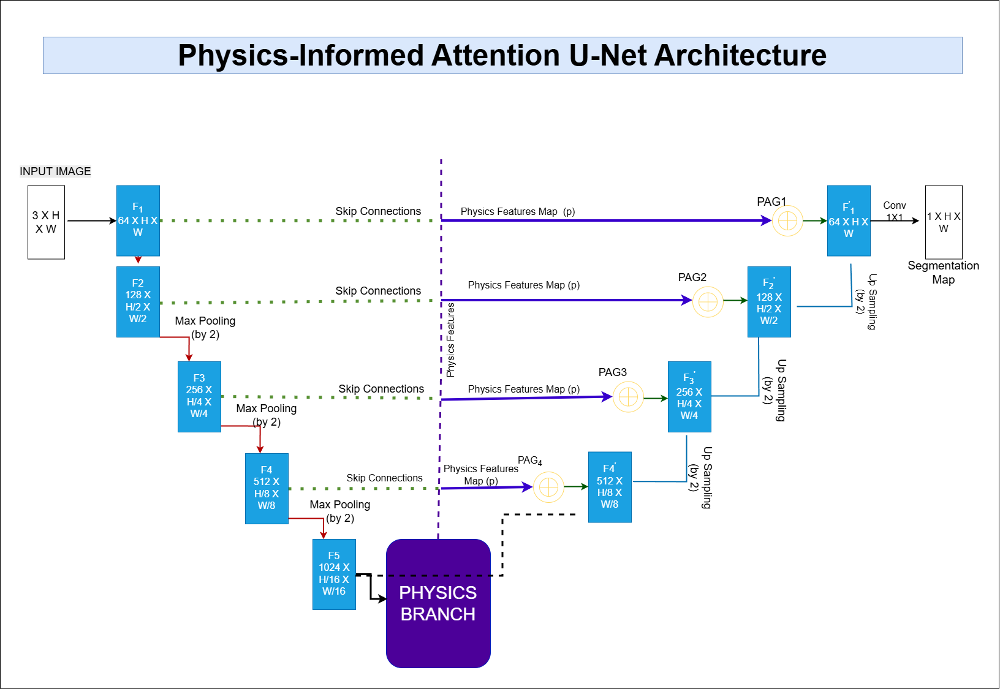
</p>

<p align="center">
  <a href="#key-results"></a>
  <a href="#key-results"></a>
  <a href="#key-results"></a>
  
  
  
</p>

<p align="center">
  <b>Alam, M., Dhavale, S. V., and Srikanth, D.</b><br/>
  <i>Indian Journal of Technical Education</i>, Vol. 48, No. 2, December 2025.<br/>
  Peer-Reviewed Publication
</p>

---

## What Is This?

Standard segmentation networks fail underwater because visibility is physically degraded by light scattering, turbidity, and backscatter — effects that change pixel statistics in ways pure data-driven models struggle to generalize across.

**PIAU-Net** solves this by embedding physics directly into the network:

1. A **Physics Branch** at the bottleneck learns turbidity (`t`) and backscatter (`b`) feature maps from the scene.
2. **Physics-Informed Attention Gates (PAGs)** use those maps to gate every skip connection, suppressing features from optically unreliable regions before they reach the decoder.
3. A **Physics-Guided Loss** adds a smoothness regularizer over the physics outputs to enforce spatial coherence during training.
4. **Deep Supervision** via two auxiliary heads stabilizes convergence.

The result: a model that is more robust to illumination variation and consistently outperforms U-Net, Attention U-Net, and DeepLab V3+ on both a controlled fish dataset and a challenging real-world underwater benchmark.

---

## Key Results

### Large-Scale Fish Dataset (Table 6.1)

| Model | mIoU (%) | Dice (%) | Precision (%) | Recall (%) | Pixel Acc. (%) |
|---|---|---|---|---|---|
| U-Net | 93.48 | 94.66 | 96.50 | 96.83 | 95.70 |
| Attention U-Net | 95.23 | 96.53 | 97.60 | 97.46 | 98.06 |
| DeepLab V3+ | 95.01 | 96.04 | 96.42 | 97.67 | 96.85 |
| **PIAU-Net (Ours)** | **97.38** | **98.18** | **98.83** | **98.53** | **99.54** |

### AquaOV255 — After Stage 2 Fine-Tuning (Table 6.2)

| Model | mIoU (%) | Dice (%) | Precision (%) | Recall (%) | Pixel Acc. (%) |
|---|---|---|---|---|---|
| U-Net (fine-tuned) | 87.79 | 90.67 | 88.96 | 92.65 | 95.10 |
| Attention U-Net (fine-tuned) | 88.05 | 90.92 | 90.29 | 91.59 | 95.38 |
| DeepLab V3+ (fine-tuned) | 90.54 | 94.91 | 95.83 | 94.04 | 97.50 |
| **PIAU-Net (Ours)** | **93.98** | **96.85** | **96.56** | **97.13** | **98.41** |

PIAU-Net leads every metric on both datasets.

---

## Visual Results

### Large-Scale Fish Dataset

<p align="center">
  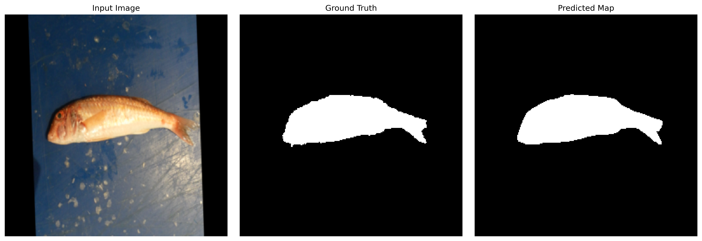
  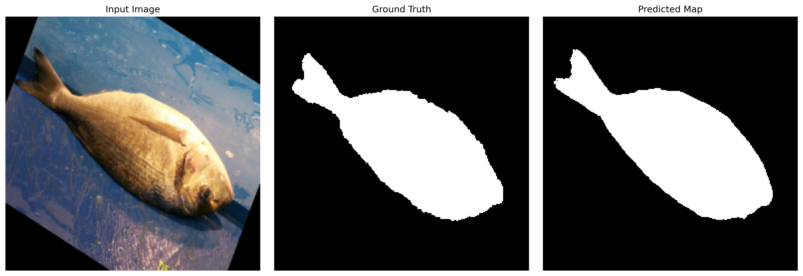
  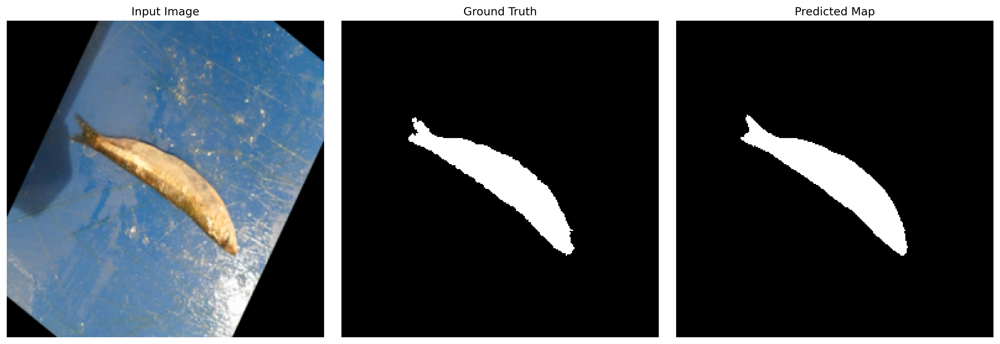
</p>

### AquaOV255 Dataset

<p align="center">
  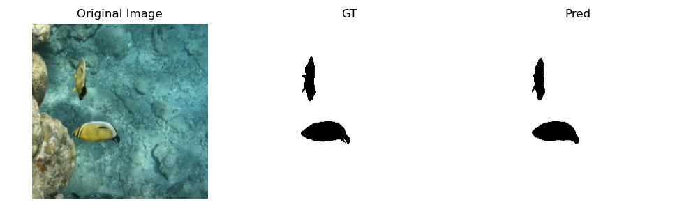
  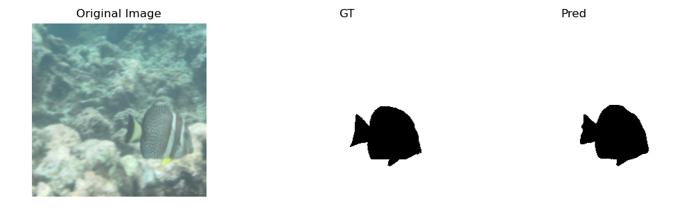
  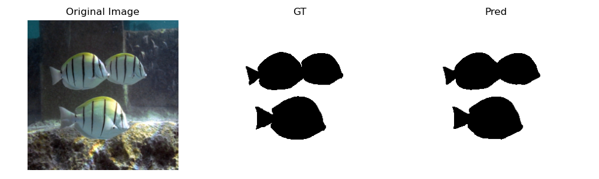
</p>
<p align="center">
  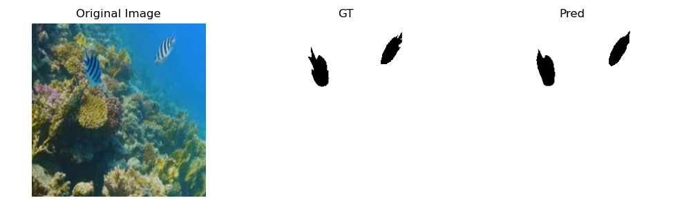
  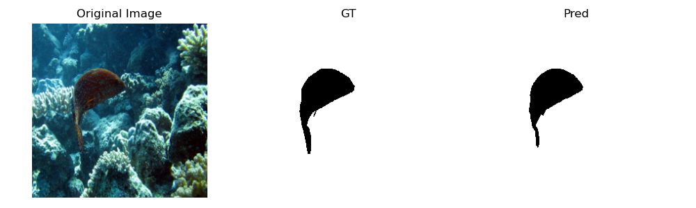
  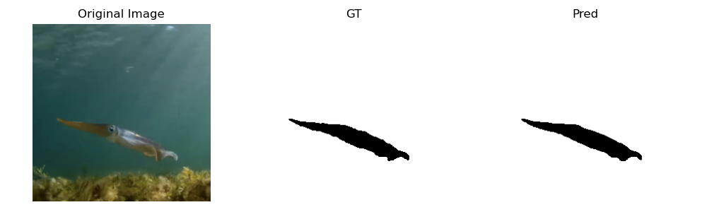
</p>

Each panel shows: **Input Image | Ground Truth Mask | PIAU-Net Prediction**.

---

## Architecture

<p align="center">
  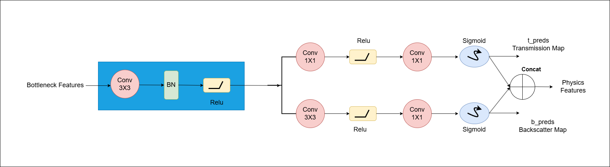
</p>

The encoder–decoder backbone follows U-Net. The key additions are:

```
Input → Encoder (4 levels, 64–512ch)
       ↓
   Bottleneck → PhysicsGuidedModule → (t map, b map, phys_feat)
       ↓
   bottleneck_proj(cat[encoder_feat, phys_feat])
       ↓
Decoder Level 3: upsample → PAG(g, skip, t) → ConvBlock
Decoder Level 2: upsample → PAG(g, skip, t) → ConvBlock
Decoder Level 1: upsample → PAG(g, skip, t) → ConvBlock
       ↓
   seg_main (primary head) + seg_aux1, seg_aux2 (deep supervision)
   j_head (illumination output)
```

**Physics-Aware Attention Gate (PAG):**

```
alpha = Sigmoid( ReLU( W_g(g) + W_x(skip) + W_phys(t_upsampled) ) )
output = skip * alpha
```

The turbidity map `t` acts as a spatial confidence weight — regions with heavy scattering receive lower attention, directing the decoder toward optically reliable features.

---

## Project Structure

```
PIAUNet/
├── model/
│   └── model.py              # PhysicsInformedAttentionUNet, PAG, ConvBlock
├── physics/
│   ├── physicsComponents.py  # PhysicsGuidedModule (turbidity + backscatter)
│   └── physicsFunctions.py   # Physics utility functions
├── lossfunction/
│   └── lossFunction.py       # Physics-guided loss with smoothness regularizer
├── dataset/
│   └── datasets.py           # Data loaders, CLAHE, mask validation
├── train/
│   ├── train.py              # Training loop (AMP, grad clip, deep supervision)
│   └── tune.py               # Hyperparameter tuning
├── testing/
│   └── test.py               # Test loop (TTA, per-image IoU, visualization)
├── baseline_models/
│   └── comparisonModels.py   # U-Net, Attention U-Net, DeepLab V3+
├── metrics/                  # Metric computation
├── visualization/            # Plotting utilities
├── TestResults/
│   ├── LargeFishDataset/     # Qualitative results on Fish Dataset
│   └── AquaOV255Dataset/     # Qualitative results on AquaOV255
├── main.py                   # CLI entry point (train / test / tune)
└── requirements.txt
```

---

## Quickstart

### Install

```bash
pip install -r requirements.txt
```

A CUDA-capable GPU is strongly recommended.

### Train

```bash
# From scratch on the Fish Dataset
python main.py --mode train --dataset_root "./Fish Dataset" --epochs 30

# From scratch on AquaOV255
python main.py --mode train --dataset_root ./AquaOV255 --epochs 30

# Resume from checkpoint
python main.py --mode train --checkpoint checkpoints/best.pth --epochs 60
```

### Test

```bash
python main.py --mode test --checkpoint checkpoints/best.pth --dataset_root ./AquaOV255
```

### Hyperparameter Tuning

```bash
python main.py --mode tune --dataset aqua --dataset_root ./AquaOV255
```

### Full CLI Reference

| Argument | Default | Description |
|---|---|---|
| `--mode` | `train` | `train`, `test`, or `tune` |
| `--dataset_root` | `./AquaOV255` | Path to dataset root |
| `--checkpoint` | `None` | Checkpoint path (resume or test) |
| `--epochs` | `30` | Training epochs |
| `--batch_size` | `4` | Batch size |
| `--lr` | `5e-4` | Initial learning rate |
| `--num_classes` | `2` | Number of output classes |
| `--save_dir` | `results` | Output directory |

---

## Datasets

### 1. A Large-Scale Fish Dataset
- Source: [Kaggle — crowww/a-large-scale-fish-dataset](https://www.kaggle.com/datasets/crowww/a-large-scale-fish-dataset)
- Binary segmentation (fish vs. background)

### 2. AquaOV255
- Source: [arXiv:2511.07923](https://arxiv.org/abs/2511.07923)
- Real-world underwater video frames, 255 categories

Expected layout for both:

```
dataset_root/
├── images/
│   ├── sample_001.jpg
│   └── ...
└── masks/
    ├── sample_001.png   # Binary: 0 = background, 1 = foreground
    └── ...
```

The dataloader automatically filters corrupt or invalid masks and optionally applies CLAHE contrast enhancement.

---

## Training Details

| Setting | Value |
|---|---|
| Optimizer | Adam |
| LR Scheduler | Cosine Annealing |
| Mixed Precision | Yes (AMP) |
| Gradient Clipping | Yes |
| Image Size | 256 × 256 |
| Test-Time Augmentation | Horizontal flip |
| Deep Supervision | 2 auxiliary heads |

---

## Evaluation Metrics

mIoU, Dice Score, Precision, Recall, Pixel Accuracy — all computed per image and averaged over the test split.

---

## Limitations

- Physics outputs (`t`, `b`, `j`) are not explicitly supervised with ground-truth physical measurements — they are learned auxiliary features.
- Currently supports binary segmentation only.
- Attention quality depends on how well the turbidity estimate generalizes to unseen water conditions.

---

## Dependencies

```
torch>=2.0.0
torchvision>=0.15.0
numpy>=1.23.0
opencv-python>=4.6.0
Pillow>=9.0.0
albumentations>=1.3.0
matplotlib>=3.6.0
tqdm>=4.64.0
pandas>=1.5.0
```

---

## Citation

If you use this work, please cite:

```bibtex
@article{alam2025piaunet,
  title   = {Physics-Informed Attention U-Net (PIAUNet): An Enhanced U-Net Framework
             for Underwater Segmentation in Aquaculture},
  author  = {Alam, Mahboob and Dhavale, Sunita Vikram and Srikanth, D.},
  journal = {Indian Journal of Technical Education},
  volume  = {48},
  number  = {2},
  month   = {December},
  year    = {2025}
}
```
